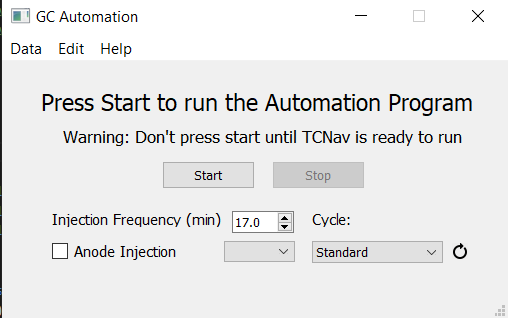
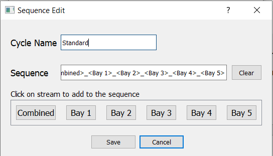
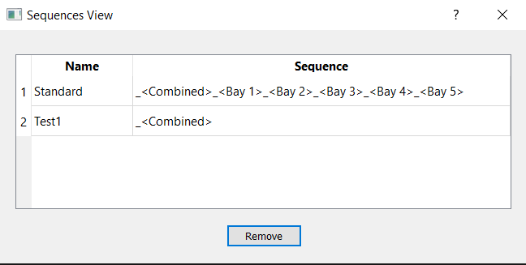
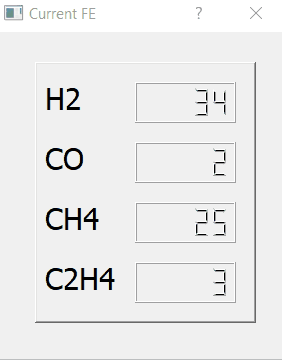
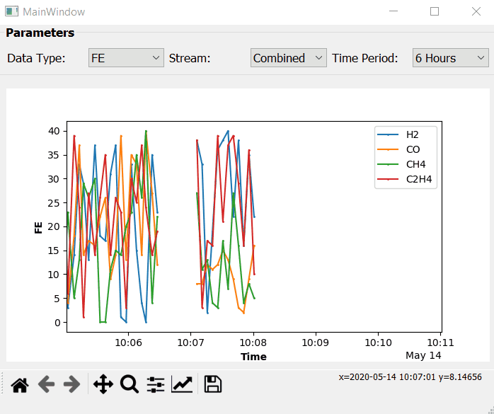

# gcGUI
A gui desktop app used to automate the data acquisition and analysis at an CO2 to Ethylene pilot plant. The app was created using a combiniation PyQt5, pyautogui and matplotlib. 

## Motivation
Within a CO2 conversion pilot, gas anylsis requires starting up the Gas Chromatography (GC) machineevery approximately 20 mins to take a sample. The software associated with the machine however does not allow for automatic run set up, therefore pyautogui was used to locate the software and run the machine manually. 

To anlyze the data, one must take the integration of different peaks in the output raw chromatogram which can become a very tedious task to do. To automate this task, the raw files must be converted into csv files. This task can only be done by image analysis through a software called openchrom. This process was then also automated using pyautogui. The csv file can be analyzed using the scipy package.

 
*example of a chromatogram output raw file and manual integration*

Additionally, there are 5 different streams of gas plus a combination of all of them that need to be cycled through every sampling cycle. Depending on the stream type, different data can be collected. To solve this problem, the main app allow the user to define the cycle in which the output gas to the sampling line take place, which side of the reactor the gas is coming from (cathode or anode), and how frequent to run the program. 

## Features
 
*The main user interface*

Allow user to define time between runs in 30 seconds increment
Allow the user to pick which defined cycle they want the program to run at (calling from a sqlite database)
Allow the user to choose if they want to switch the sampling to the anode side (anode side runs are not an often occurence)
Starting and stopping the program at anytime
Adding a newly defined cycle (saving it to a sqlite database)

 
*The window that let users create a new cycle definition and add it to the database*

Viewing saved cycles and deleting them (removal from the database)

 
*The window that let users create a new cycle definition and add it to the database*

Collect the converted data the csv files and apply Simpson's rule integration at known gas peak to find peak area
Used the collected peak areas to convert into useful data such as molar flow, FE, etc.
View an important parameter called FE in real time

 
*FE view window*

Graph all the important paramters in real time by integrating matplotlib with PyQt5

 
*Graphing window*
